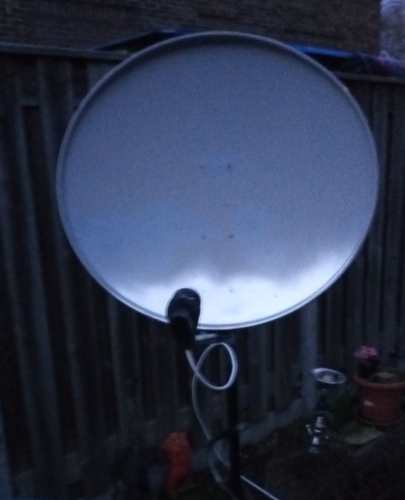
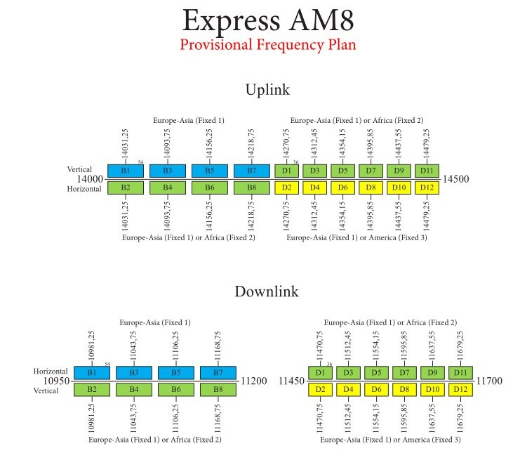
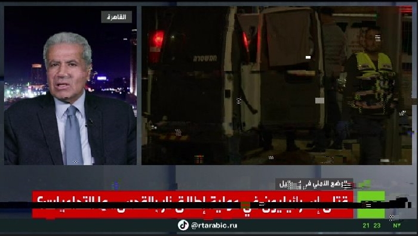
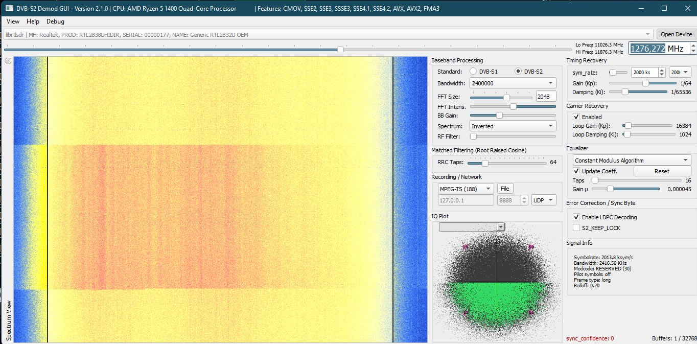
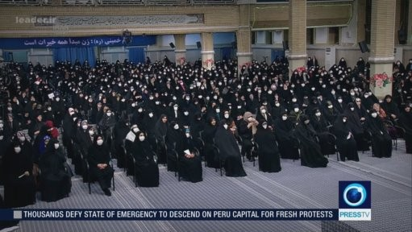

# Express AM8

Express AM8 is a Russian geostationary communications satellite.

Its content broadcasting includes a number of controversial <a href="https://rumble.com/v241fl2-play-with-sat-stuff.html">Russian</a>, Syrian and Iranian (news) channels. 
Which are banned from broadcasting by EU distributors/providers due sanctions against Russia (everything) and Iran (Press TV). 
          
## Appendix

- [ 1.0 TV and Radio Channels ](https://github.com/happysat/Express-AM8/blob/main/README.md#tv-and-radio-channels)
- [ 1.1 Satellite Description ](https://github.com/happysat/Express-AM8/blob/main/README.md#satellite-description)
- [ 1.2 Dish and LNB ](https://github.com/happysat/Express-AM8/blob/main/README.md#dish-and-lnb)
- [ 1.3 Footprint ](https://github.com/happysat/Express-AM8/blob/main/README.md#footprint)
- [ 1.4 Dish Align to Express AM8 ](https://github.com/happysat/Express-AM8/blob/main/README.md#dish-align-to-express-am8)
- [ 1.5 Transponders and Frequencies ](https://github.com/happysat/Express-AM8/blob/main/README.md#telemetry-transponders-and-beacon-frequencies)
- [ 1.6 T2-MI Technology ](https://github.com/happysat/Express-AM8/blob/main/README.md#t2-mi-technology)
- [ 1.7 Satellite Receivers ](https://github.com/happysat/Express-AM8/blob/main/README.md#satellite-receivers)
- [ 1.8 DVB-S Card Software ](https://github.com/happysat/Express-AM8/blob/main/README.md#dvb-s-card-software)
- [ 1.9 Codecs, Players, Streaming Software ](https://github.com/happysat/Express-AM8/blob/main/README.md#codecs-players-streaming-software)
- [ 2.0 Electronic Program Guide XMLTV](https://github.com/happysat/Express-AM8/blob/main/README.md#electronic-program-guide-xmltv)
- [ 2.1 News and Updates ](https://github.com/happysat/Express-AM8/blob/main/README.md#news-and-updates)
- [ 2.2 Disclaimer ](https://github.com/happysat/Express-AM8/blob/main/README.md#disclaimer)

## TV and Radio Channels
The following TV and Radio channels are broadcasted in DVB-S(2) HD thru Express-AM8:

RT Int., RT Deutsch, RT France, RT Espanol, RT Arabic. 

Russian: Rossiya 24, RTR Planeta, NTV Mir, Perivy Kanal, Podeba, Karusel, Radio Sputnik. 

Belarus: Belarus 24 HD, Radio Belarus Int. 

Iran: Irib TV 1, Sahar TV Bosnian/Azari, Press TV HD, Hispan TV, iFilm, Al Alam TV. 

Syria: Syria Sat Ch., Syria Sport 24, Syria 1, Syria News, Syria Drama, Sakaker Kids. 

Lebanon: Etihad TV, Al Manar TV, Al Nour Radio. 

## Satellite Description

Operated and owned by RSCC (Russian Satellite Communications Company) from an orbital slot at 14° Degrees West. 
<a href="https://www.n2yo.com/satellite/?s=40895#results">Express-AM8</a> will provide high quality fixed and mobile communication services. 

As well as broadcast services for digital television and radio, data transmission,
high-speed Internet access and secure government communications. 

<a href="https://orbit.ing-now.com/satellite/40895/2015-048a/express-am8/">Express-AM8</a> (Norad:40895 2015-048A) was launched by a Proton M launcher into orbit on September 14, 2015. 
Thales Alenia Space, constructed Express-AM8 payload, and ISS Reshetnev constructed the satellite bus which was based on the Ekspress-1000NTB platform. 
The satellite has a mass of 2,100 kg (4,600 lb), provides 5.9 kilowatts to its payload, and a planned operational lifespan of 15 years. 

It should be taken into account that Express AM8 is not an ordinary DTH high power satellite like Astra and Hotbird! 

Express AM8 is subject to frequent frequency and signal strength changes. 
Transponder with low symbolrates are used, and many test's are performed varying from DVB-S(2) to T2-MI. 

Transponders/Channels details and info can change on a daily base. 
Which makes this a interesting exotic "DX" satellite with trans-atlantic coverage and custom cross-strap footprint configurations. 

The satellite transponders are also regularly hacked or disrupted by jamming signals. 
This is no unique case and it did happen at Eutelsat Hotbird Position (and a number of other satellites) also. 

## Dish and LNB

For reception of Express-AM8 you need a dish in size >75 - 85 cm. 
A size between 80 - 1.20 cm is recommended. 

Dishes In use on my setup are: 
           
          
          &nbsp; &nbsp; &nbsp; &nbsp;&nbsp; &nbsp;  

89CM Triax And 90CM Noname Dish.
          
Any Ku-band Satellite TV (DRO/PLL-based) LNB can be used for Express AM8. 
I have various results with DRO and PLL based ones but shows clearly a huge increase of frequency stability YMMV. 

Regular Ku-band Satellite TV LNB (DRO) suffer from drift in frequency making it more difficult to keep a stable reception for the low symbolrate signals. 
Because of outside conditions (temperature changes, sun, clouds, wind ect). 

In use on my setup are: 

 

Invertro Ultra Black LNB (DRO Old model with longer neck). 

 

Inverto Twin (PLL) LNB. 

## Footprint

Express AM8 carries 12 Ku-band transponders with three footprints:

Europe/Middle-East Fixed 1

Africa/Middle-East Fixed 2. 
And Latin America/East coast of North America Fixed 3. 

24 C-band transponders with coverage of two footprints:

Europe, Africa and the Middle-East and Latin America and the East coast of North America. 
And the payload has two L-band transponders. 

## Dish align to Express-AM8

There are several ways to find Express-AM8 in the sky:

<a href="https://www.dishpointer.com" target="_blank">Dishpointer has a good website and Android app.</a>

Enter City location and Select Express AM8 to see all details.

Take into account the skew settings of the LNB! 
Dish Pointer website list the skew values for Express AM8 below the image of your selected location. 

Or the program <a href="http://www.al-soft.com/saa/satinfo.shtml" target="_blank">Satellite Antenna Alignment 4.0</a> 
For Dish alignment and many more options. 

Examples of Video's  Express AM8 Reception:

&nbsp; &nbsp; &nbsp; &nbsp;&nbsp; &nbsp; 

## Telemetry, Transponders and Beacon Frequencies.

Telemetry and Beacon Frequencies: 

 

11199.50 GHz R (Global). 
 
 
[Up2date Express AM8 Transponder.ini file](https://github.com/happysat/Express-AM8/blob/main/3460.ini) 
 
 

 
Lyngsat Transponder Index 
 

 
KingOfSat Transponder Index 

## T2-MI Technology

T2-MI (T2 Modulator Interface) is a method of encapsulating a satellite signal into an MPEG TS transport stream. 
In simple terms, using the T2Mi interface, channel packages in the DVB-T2 standard are transmitted from the satellite to base
earth stations for further distribution to T2 towers,  
which then transmit terrestrial digital television for TVs or DVB-T2 receivers. &nbsp; 
That is, the channel packages in T2MI were not originally intended to be received by domestic satellite receivers.  
But with the development of processors for satellite receivers capable of processing them, it became possible to receive these TV channels at home on a regular home satellite receiver. 

Update T2-MI Multistreams with the Russian package appear to have completely migrated to the Express AM6 53° East! 

Express AM8 did have a few T2-MI transponders. 

 

Broadcasting channels to DVB-T2 Multiplexes in Ukraine.

## Satellite Receivers

Well, there is plenty of choice in this area, it depends a bit on what you want to see. 

 

A lot is already possible to see with a normal HD receiver and it does not have to be new state of the art. 
Off course for the T2-MI Multiplexes to show, one need a new generation receiver or <a href="https://www.tbsdtv.com/">TBS DVB-S Card</a> is recommended. 

Ci, softcam's or smart cards are not necessary because everything is broadcasting Free To Air. 
This may change for the T2-MI Multiplexes in the future. 

Receivers in use on my setup are: 

Dreambox 800se <a href="https://github.com/jack2015/openpli-dreambox-oe-core" target="_blank">OpenPLI 12.2</a> 
VuSolo2 <a href="http://images.mynonpublic.com/openatv/7.1/index.php?open=vusolo" target="_blank">Open-ATV</a> 
<a href="https://www.tbsdtv.com/" target="_blank">TBS Q-Box2</a>. 

## DVB-S Card Software

There is a lot of (free) software choice for the DVB-S cards. 
Varying from TV application viewers till stream analyzers. 

<a href="https://www.altx.ro/projects/altdvb/" target="_blank">AltDVB</a>
is a free software for watching digital TV on your windows PC using a dedicated DVB hardware device. 
It does support DVB-S/S2 and T2-MI standards, 
Picture-in-Picture (PIP), LAN Streaming, and many other options and features. 

 

<a href="http://www.smartdvb.net/tempsite/index.html" target="_blank">SmartDVB</a> 
is a free digital-tv watch application for satellite TV cards.  
It supports DVB-S/S2 and T2-MI standards. 
XMLTV import option for EPG, streaming, PIP, and other options and features. 

 

<a href="https://sourceforge.net/projects/crazyscan/" target="_blank">Crazyscan</a>, <a href="http://ebspro.net/overview/" target="_blank">EBSPro</a> and <a
href="https://www.satellitescommunity.de/forum/index.php?thread/2005-iqmonitor-only-files/&amp;postID=45835#post45835" target="_blank">IQ Monitor</a> - Free analyzer tools for satellite DVB-tuners to show details and info about stream info,  
blind scanning, signalInfo, constellations and many more options. 

 

## Codecs, Players, Streaming Software

Software DVB-S Demodulator

 

The demodulator works with RTL-SDR, Airspy, HackRF, SDRplay and PlutoSDR. 
It can demodulate DVB-S and S2 signals with very low symbolrate, but not above 2000 ks. 

[More about Software DVB-S Demodulator Overhere.](https://github.com/happysat/Es-Hail-2-Oscar-100#software-dvb-s-demodulator) 

[And setup SDR on LNB Ouput.](https://github.com/happysat/Es-Hail-2-Oscar-100#bias-tee) 

 
<a href="https://github.com/DYefremov/DemonEditor" target="_blank">DemonEditor</a> 

Enigma2 channel and satellite list editor for Windows and Linux. 

Main features of the program: 

Editing bouquets, channels, satellites, Import/Backup function, Support of picons. 
Export of bouquets with IPTV services in m3u. 
Assignment of EPG from DVB or XML for IPTV services, Playback of IPTV or other streams. 

 
<a href="https://mpv.io/">Mpv</a>
Free, open source, and cross-platform media player. 

<a href="https://github.com/Nevcairiel/LAVFilters/releases">LAV Filters</a> are a set of DirectShow filters based on the libavformat and libavcodec libraries from the ffmpeg project. 

 

Which will allow you to play virtually any format in a DirectShow player. 

<a href="http://madvr.com/">madVR</a> is a DirectShow video renderer used by hundreds of thousands of home theater enthusiasts around the world. 
Designed as a no-compromise approach, madVR delivers the ultimate video playback quality that no enthusiast should be without. 
          
## Electronic Program Guide XMLTV

TV Channels on Express AM8 are not broadcasting Electronic Program Guide Data. 
It is possible to import EPG data yourself in XMLTV format. 

The enigma2 based receivers are having the rytec plugin in their image feed for importing epg data. 

 

DVB-S card software including Smartdvb can import XMLTV so that an epg guide can be seen for the TV channels of Express AM8. 

 

Also in the seperate Guides

 

 

Download XMLTV EPG for: 

Right click the Raw button at the top of the file, select Save Link As. 
Rename .txt to .xml 

[RT Germany](https://github.com/happysat/Express-AM8/blob/main/rt_de.xml) 

[RT Int, Rossia-24, NTV MIR, 1TVRUS Europe, Karusel, RTR-Planeta Evropa and Belarus24 HD.](https://github.com/happysat/Express-AM8/blob/main/rus.xml) 

## News and Updates

30 January 

T2-MI Multistreams with the Russian package appear to have completely migrated to the Express AM6 53° East. 
The channels in T2-MI were originally intended for DVB-T2 terrestrial broadcasting in Novorossia. 

27 January 

A number of Transponders do indeed have more transmission power. 

 

11541 H RT Arabic, Fix Ku2, 21 % / 3,40 dB. 

 

The jamming continues, clearly visible on transponder B3 11025 H Rossiya 24 and RTR Planeta. 

26 January 

 

Jamming signal on RT and almost all other Russian transponders. 
Some Transponders are showing increased signals levels then usual. 

T2-MI Transponder on 11647 Off.

25 January 

TV broadcasts in Russia’s southwest were briefly disrupted by an address from the Ukrainian president, disruption affected satellite broadcasts, according to the press service of the regional government.  
Operators had to re-direct the signal from a backup satellite. 

<a href="https://thepressunited.com/updates/zelensky-appears-on-russian-tv/" target="_blank">Zelensky appears on Russian TV</a>. 

24 January 

Pobeda back as "POBEDA int" on 11653 V 4880 2/3. 

 

23 January 

IRIB - JAMEJAM1 HD, SAHAR BALKAN/AZARI, PRESS TV HD, HISPAN TV, iFILM ENGLISH, ALALAM HD - 11670 H 16596.

21 January 

PRESS TV HD - 11498 H Gone.

20 January 

Syria, Syria Sport 24, Syria CH1, Syria News, Drama 24, Sakaker - 11690 H 12110.

 

PRESS TV HD - 11498 H 6938. 

 

18 January 

1TVRUS are now broadcasting in 2/3.  
Pobeda is switched off. 
Many interruptions on RT Transponder.  

 

 

17 January 

Syrian Transponder clear 11600 V. 

5 January 2023 

Express AM8 transponder 11647V was hacked today at 6:30 PM by Ukrainian Ministry of Strategic Communication. 
A New Year's address by Ukrainian President V. Selensky was shortly broadcast in Ukrainian on all program positions of the T2-MI transponder. 

 

21 July 2022 
<a href="https://eng.rscc.ru/press/satellite-being-born-siberia-rscc-signs-contract-r/">Express AM4 launch is planned in 2026.</a> 

It will occupy the slot at 11°W on geostationary orbit and will also reserve 14°W. 
The satellite will be delivered in orbit by Khrunichev Space Center using the Proton launch vehicle. 

Equipped with a 63 active transponders at a payload power of 14 kW for its planned 15-year service life in orbit.  
Its ten antennas will provide high performance coverage over the Russian Federation and the CIS countries and its steerable antennas can be used to provide communication to any point within the satellite's visibility. 

## Disclaimer

This website is for educational purpose only. 
The European Union labels alternative news sources on this satellite as propaganda. 

Residents of the European Union are allowed to view this content, but may not live distribute it. 
This satellite and it contents broadcasting channels are controlled by RSCC (Russian Satellite Communications Company).

## Author

- [Express AM8 by Happysat](https://github.com/happysat/Express-AM8)
