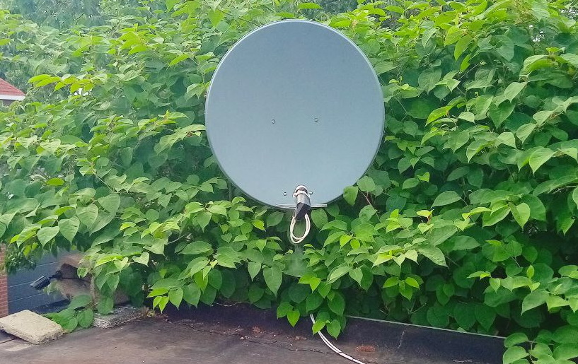
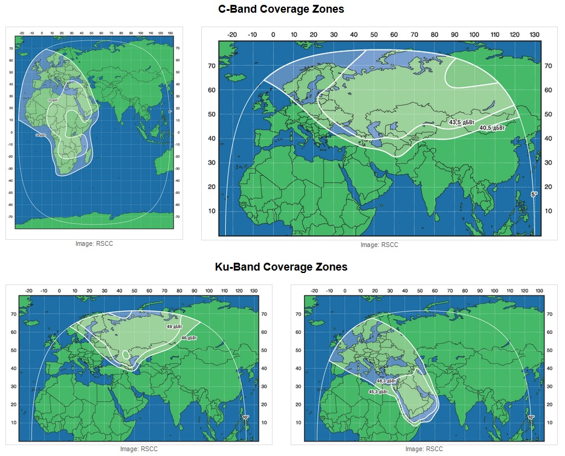
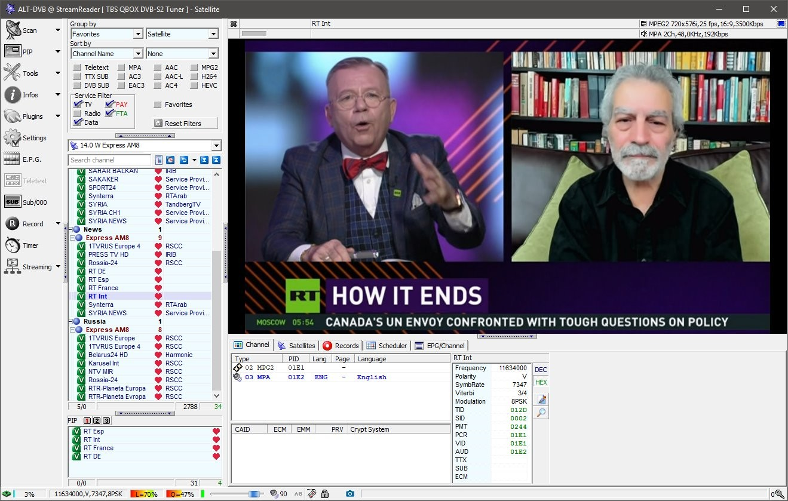
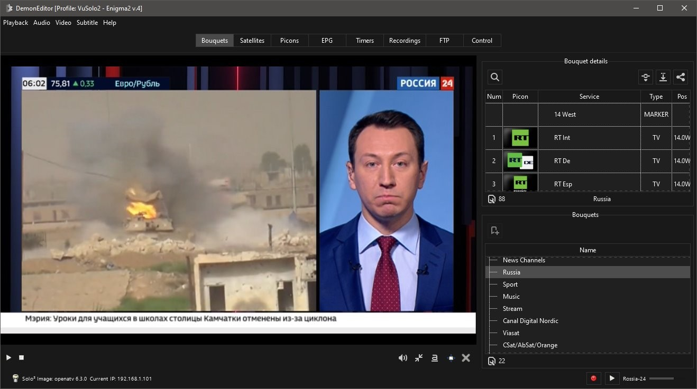
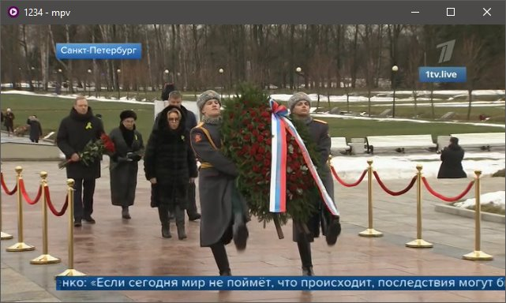
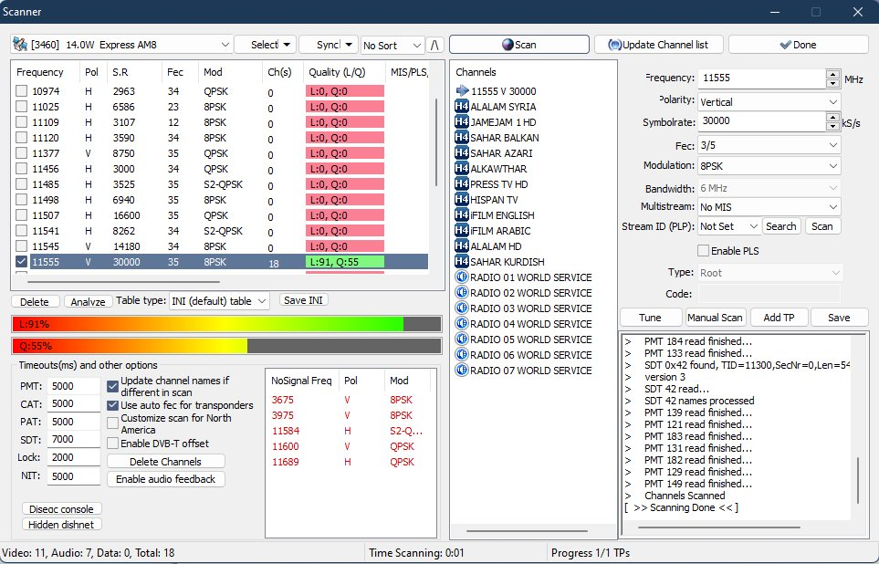
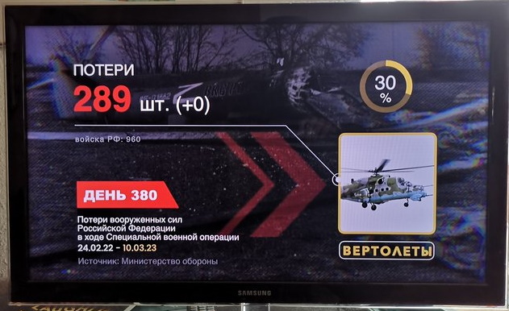
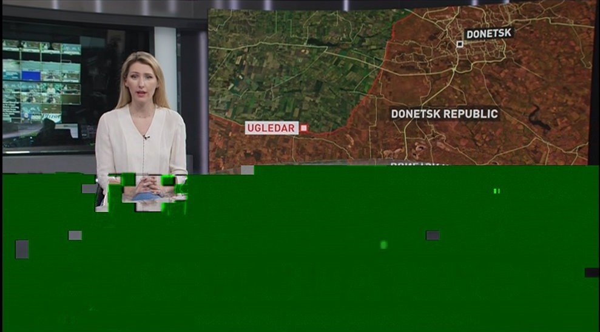
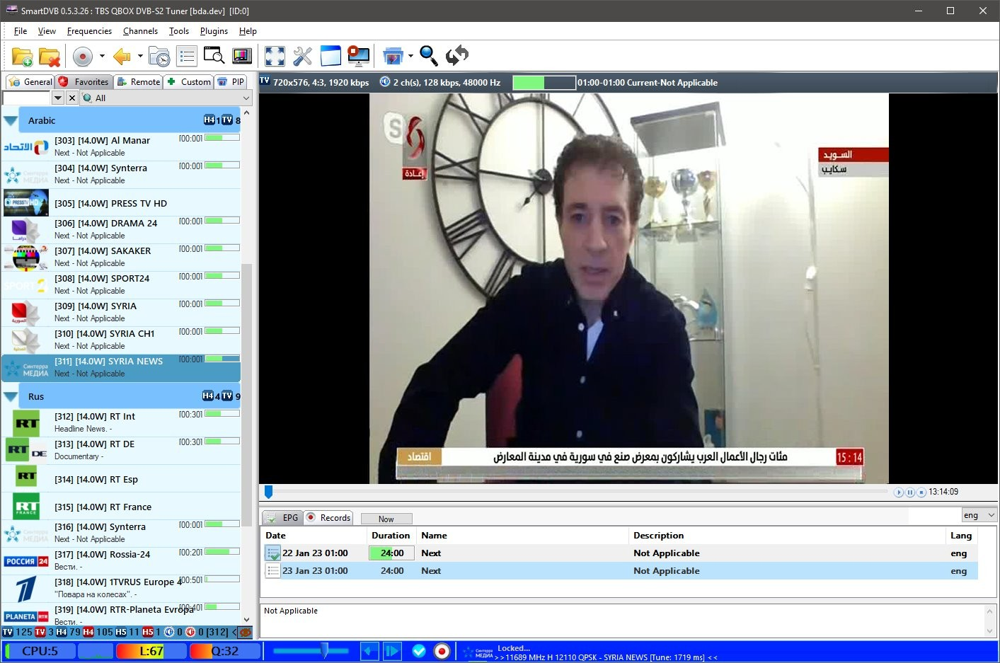
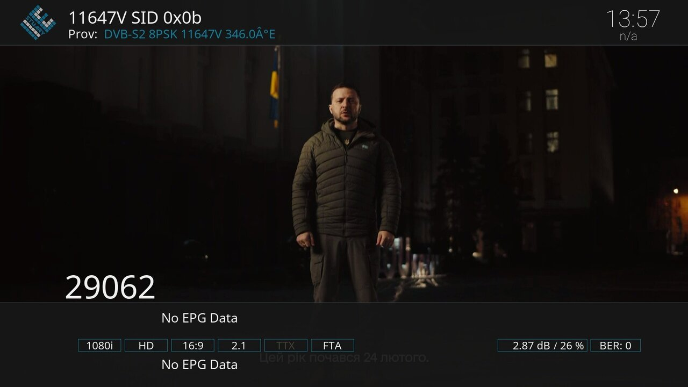

# Express AM6 and AM8

Express AM6 and AM8 are Russian geostationary communications satellites.

Its content broadcasting includes a number of controversial <a href="https://rumble.com/v241fl2-play-with-sat-stuff.html">Russian</a>, Syrian and Iranian (news) channels. 
Which are banned from broadcasting by EU distributors/providers due sanctions against Russia (everything) and Iran (Press TV). 
          
## Appendix

- [ 1.0 TV and Radio Channels ](https://github.com/happysat/Express-AM8/blob/main/README.md#tv-and-radio-channels)
- [ 1.1 Satellite Description ](https://github.com/happysat/Express-AM8/blob/main/README.md#satellite-description)
- [ 1.2 Dish and LNB ](https://github.com/happysat/Express-AM8/blob/main/README.md#dish-and-lnb)
- [ 1.3 Footprint ](https://github.com/happysat/Express-AM8/blob/main/README.md#footprint)
- [ 1.4 Dish Align to Express AM8 ](https://github.com/happysat/Express-AM8/blob/main/README.md#dish-align-to-express-am8)
- [ 1.5 Transponders and Frequencies ](https://github.com/happysat/Express-AM8/blob/main/README.md#telemetry-transponders-and-beacon-frequencies)
- [ 1.6 T2-MI Technology ](https://github.com/happysat/Express-AM8/blob/main/README.md#t2-mi-technology)
- [ 1.7 Satellite Receivers ](https://github.com/happysat/Express-AM8/blob/main/README.md#satellite-receivers)
- [ 1.8 DVB-S Card Software ](https://github.com/happysat/Express-AM8/blob/main/README.md#dvb-s-card-software)
- [ 1.9 Codecs, Players, Streaming Software ](https://github.com/happysat/Express-AM8/blob/main/README.md#codecs-players-streaming-software)
- [ 2.0 News and Updates ](https://github.com/happysat/Express-AM8/blob/main/README.md#news-and-updates)
- [ 2.1 Disclaimer ](https://github.com/happysat/Express-AM8/blob/main/README.md#disclaimer)

## TV and Radio Channels
The following TV and Radio channels are broadcasted in DVB-S(2) HD thru Express AM6 and AM8:

RT Int., RT Deutsch, RT France, RT Espanol, RT Arabic. 

Russian: Rossiya 24, RTR Planeta, NTV Mir, Perivy Kanal. 

Belarus: Belarus 24 HD, Radio Belarus Int. 

Iran: Irib TV 1, Sahar TV Bosnian/Azari, Press TV HD, Hispan TV, iFilm, Al Alam TV. 

Syria: Syria Sat Ch., Syria Sport 24, Syria 1, Syria News, Syria Drama, Sakaker Kids. 

Lebanon: Etihad TV, Al Manar TV, Al Nour Radio. 

## Satellite Description

Operated and owned by RSCC (Russian Satellite Communications Company) Express AM6 and AM8 from an orbital slot at 14° Degrees West and 53° Degrees East. 

Express AM6 and AM8 are providing fixed and mobile communication services. 

As well as broadcast services for digital television and radio, data transmission,
high-speed Internet access and secure government communications. 

 

<a href="https://orbit.ing-now.com/satellite/40277/2014-064a/express-am6/">Express-AM6</a> (Norad:40277 2014-064A) was launched by a Proton M launcher from Baikonur Cosmodrome into orbit on October 21, 2014. 
The Briz-M upper stage shut down too early in the fourth burn and left the satellite in a lower than planned orbit.  
The satellite reached the operational geostationary orbit by using its own SPT-100 Stationary Plasma Thrusters. 

MacDonald, Dettwiler and Associates Ltd. (MDA), constructed the Express AM6 payload, and ISS Reshetnev constructed the satellite bus which was based on the Express-2000 platform. 
The satellite has a mass of 3,400 kg (7,403 lb), provides 14 kilowatts to its payload, and a planned operational lifespan of 15 years. 

<a href="https://orbit.ing-now.com/satellite/40895/2015-048a/express-am8/">Express-AM8</a> (Norad:40895 2015-048A) was launched by a Proton M launcher from Baikonur Cosmodrome into orbit on September 14, 2015. 

Thales Alenia Space, constructed the Express AM8 payload, and ISS Reshetnev constructed the satellite bus which was based on the Express-1000NTB platform. 
The satellite has a mass of 2,100 kg (4,600 lb), provides 5.9 kilowatts to its payload, and a planned operational lifespan of 15 years. 

It should be taken into account that Express AM6 and AM8 are no ordinary DTH high power satellites like Astra and Hotbird! 

Express AM6 and AM8 are subject to frequent frequency and signal strength changes. 
Transponder with low symbolrates are used, and many test's are performed varying from DVB-S(2) to T2-MI. 

Transponders/Channels details and info can change on a daily base. 
Which makes this a interesting exotic "DX" satellite with trans-atlantic coverage and custom cross-strap footprint configurations. 

The satellite transponders are also regularly hacked or disrupted by jamming signals. 
This is no unique case and it did happen at Eutelsat Hotbird Position (and a number of other satellites) also. 

## Dish and LNB

For reception of Express AM6 and AM8 you need a dish in size >75 - 85 cm. 
A size between 80 - 1.20 cm is recommended. 

Dishes In use on my setup are: 
           
          
          &nbsp; &nbsp; &nbsp; &nbsp;&nbsp; &nbsp;  

2 x 89CM Triax Dish on 14 West and 53 degrees East.
          
Any Ku-band Satellite TV (DRO/PLL-based) LNB can be used for Express AM6 and AM8. 
I have various results with DRO and PLL based ones but shows clearly a huge increase of frequency stability YMMV. 

Regular Ku-band Satellite TV LNB (DRO) suffer from drift in frequency making it more difficult to keep a stable reception for the low symbolrate signals. 
Because of outside conditions (temperature changes, sun, clouds, wind ect). 

In use on my setup are: 

 

Invertro Ultra Black LNB (DRO Old model with longer neck). 

 

Inverto Twin (PLL) LNB. 

## Footprint

Express AM6 carries 44 Ku-band, 14 C-band, 12 Ka-band and 2 L-band transponders with four footprints.

Two fixed and two steerable Ku-Band beams are served by 44 active Ku-Band transponders.  
The fixed Ku-Zones include a Russian Beam that covers the western half of the country and portions of eastern Europe. 

While the second Ku-Zone stretches from the Middle East all the way across Central Europe into the northern countries. 
Mobile Ku-Beams can be used to provide communications coverage to regions of high demand. 

The first C-Band fixed zone covers a large portion of Russia.  
Second C-Band beam covers the entire continent of Africa, Saudi Arabia and western and central Europe. 
Global C-Band beam provides coverage of the entire continent of Europe and Africa also covering portions of Asia and Australia. 

In March 2020 the five-year-old satellite's Ka-band payload was shut off due to a thermal control system malfunction with the spacecraft. 
 
Express AM8 carries 12 Ku-band transponders Linear 12x36 MHz; 4x54 MHz (150W) with three footprints: 
 

Europe/Middle-East Fixed 1. 

Africa/Middle-East Fixed 2. 
And Latin America/East coast of North America Fixed 3. 

24 C-band transponders Circular 24x40 MHz (100W) with coverage of two footprints:

Europe, Africa and the Middle-East and Latin America and the East coast of North America. 
And the payload has two L-band transponders. 

## Dish align to Express-AM8

There are several ways to find Express AM6 and AM8 in the sky:

<a href="https://www.dishpointer.com" target="_blank">Dishpointer has a good website and Android app.</a>

Enter City location and Select Express AM6 and AM8 to see all details.

Take into account the skew settings of the LNB! 
Dish Pointer website list the skew values for Express AM6 and AM8 below the image of your selected location. 

For 14 West try to search and tune for the strongest transponder <a href="https://en.kingofsat.net/tp.php?tp=12862" target="_blank">11637 V DVB-S2 QPSK Symbolrate 30000 FEC 1/2.</a> 

For 53 East try to search and tune for this transponder <a href="https://en.kingofsat.net/tp.php?tp=1819" target="_blank">11481 H DVB-S2 QPSK Symbolrate 27500 FEC 3/4.</a> 

Or the program <a href="http://www.al-soft.com/saa/satinfo.shtml" target="_blank">Satellite Antenna Alignment 4.0</a> 
For Dish alignment and many more options. 

Examples of Video's  Express AM8 Reception:

&nbsp; &nbsp; &nbsp; &nbsp;&nbsp; &nbsp; 

## Telemetry, Transponders and Beacon Frequencies.

Telemetry and Beacon Frequencies: 

 

11199.50 GHz R (Global). 
3405.40 GHz R. 
3850.00 GHz R. 
3850.50 GHz L. 
 
[Express AM6 Transponder.ini file](https://en.kingofsat.net/dl.php?pos=53E&fkhz=0) 
 
[Express AM8 Transponder.ini file](https://en.kingofsat.net/dl.php?pos=14W&fkhz=0) 
 
 
Lyngsat Express AM6 Transponder Index. 
 
 
Lyngsat Express AM8 Transponder Index. 
 
 
 
King Of Sat Express AM6 Transponder Index. 
 
 
King Of Sat Express AM8 Transponder Index. 

## T2-MI Technology

T2-MI (T2 Modulator Interface) is a method of encapsulating a satellite signal into an MPEG TS transport stream. 
In simple terms, using the T2Mi interface, channel packages in the DVB-T2 standard are transmitted from the satellite to base
earth stations for further distribution to T2 towers,  
which then transmit terrestrial digital television for TVs or DVB-T2 receivers. &nbsp; 
That is, the channel packages in T2MI were not originally intended to be received by domestic satellite receivers.  
But with the development of processors for satellite receivers capable of processing them, it became possible to receive these TV channels at home on a regular home satellite receiver. 

Express AM8 did have a few T2-MI transponders. 

 

Broadcasting channels to DVB-T2 Multiplexes in Ukraine.

Update T2-MI Multistreams with the Russian package appear to have completely migrated to the Express AM6 53° East! 

## Satellite Receivers

Well, there is plenty of choice in this area, it depends a bit on what you want to see. 

 

A lot is already possible to see with a normal HD receiver and it does not have to be new state of the art. 
Ci, softcam's or smart cards are not necessary because everything is broadcasting Free To Air. 

Off course for the T2-MI Multiplexes to show or even more, one need a new generation receiver or even better a <a href="https://www.tbsdtv.com/">TBS DVB-S Card</a> is recommended. 

Capable of receiving digital TV channels of multiple standards: DVB-S2X/S2/S/DVB-T2/C2/T/C(J.83 A/B/C)/ISDB-T/C/ATSC1.0  
Also supporting CCM, VCM and Multi Input Streams. 

Advantages are analyzing streams, faster blindscanning, wide software choice (viewers/headends), multipule platform support Linux/Windwows/ARM, media features Kodi, adding second tuners in engima2 based recievers. 

Receivers in use on my setup are: 

<a href="https://www.tbsiptv.com/tbs5530-multi-standard-universal-tv-tuner-usb-card" target="_blank">TBS5530</a>. 

## DVB-S Card Software

There is a lot of (free) software choice for the DVB-S cards. 
Varying from TV application viewers till stream analyzers. 

<a href="https://www.altx.ro/projects/altdvb/" target="_blank">AltDVB</a>
is a free software for watching digital TV on your windows PC using a dedicated DVB hardware device. 
It does support DVB-S/S2 and T2-MI standards, 
Picture-in-Picture (PIP), LAN Streaming, and many other options and features. 

 

<a href="http://www.smartdvb.net/tempsite/index.html" target="_blank">SmartDVB</a> 
is a free digital-tv watch application for satellite TV cards.  
It supports DVB-S/S2 and T2-MI standards. 
XMLTV import option for EPG, streaming, PIP, and other options and features. 

 

<a href="https://sourceforge.net/projects/crazyscan/" target="_blank">Crazyscan</a>, <a href="http://ebspro.net/overview/" target="_blank">EBSPro</a> and <a
href="https://www.satellitescommunity.de/forum/index.php?thread/2005-iqmonitor-only-files/&amp;postID=45835#post45835" target="_blank">IQ Monitor</a> - Free analyzer tools for satellite DVB-tuners to show details and info about stream info,  
blind scanning, signalInfo, constellations and many more options. 

 

## Codecs, Players, Streaming Software

Software DVB-S Demodulator

 

The demodulator works with RTL-SDR, Airspy, HackRF, SDRplay and PlutoSDR. 
It can demodulate DVB-S and S2 signals with very low symbolrate, but not above 2000 ks. 

[More about Software DVB-S Demodulator Overhere.](https://github.com/happysat/Es-Hail-2-Oscar-100#software-dvb-s-demodulator) 

[And setup SDR on LNB Ouput.](https://github.com/happysat/Es-Hail-2-Oscar-100#bias-tee) 

 
<a href="https://github.com/DYefremov/DemonEditor" target="_blank">DemonEditor</a> 

Enigma2 channel and satellite list editor for Windows and Linux. 

Main features of the program: 

Editing bouquets, channels, satellites, Import/Backup function, Support of picons. 
Export of bouquets with IPTV services in m3u. 
Assignment of EPG from DVB or XML for IPTV services, Playback of IPTV or other streams. 

 
<a href="https://mpv.io/">Mpv</a>
Free, open source, and cross-platform media player. 

<a href="https://github.com/Nevcairiel/LAVFilters/releases">LAV Filters</a> are a set of DirectShow filters based on the libavformat and libavcodec libraries from the ffmpeg project. 

 

Which will allow you to play virtually any format in a DirectShow player. 

<a href="http://madvr.com/">madVR</a> is a DirectShow video renderer used by hundreds of thousands of home theater enthusiasts around the world. 
Designed as a no-compromise approach, madVR delivers the ultimate video playback quality that no enthusiast should be without. 

## News and Updates

3 July 

Jamming continues on TP 11638 V also spread to AM6 11481 H and Yamal 402 eu beam.

29 June 

11638 V back with disruptions. 

28 June 

No signal on transponder 11638 V since 3:00 p.m. 
RTR-Planeta 11484, disturbed. 

For more Russian TV channels in Europe (except Perviy kanal) you need to contact Express AM-6 53 Ost 11481 H. 

25 June 

RTR-Planeta/Rossiya-24 left TP 11025. 

15 June 

NTV 11108 H and Belarus-24 on 11638 H No signal. 

Jamming on 11638 MHz V. 

Belarus-24 added to 11638 MHz V. 

29 May 

New 11638 MHz V, 30000 Symbolrate, FEC 1/2 DVB-S2 QPSK,
Perviy Kanal Europa, RTR Planeta Europa, Rossia 24 and Karusel Int. 

Perviy kanal Europa (TEST) left 11653 V. 

Dom Kino, Karusel International left 11624 V. 

13 May 

RT and Synterra left Transponder 11638 V / 11121 H (Still available at 53 East). 

29 April 

1TVRus testcard gone, broadcasting again. 

IRIB left 11544 V DVB-S2/8PSK 13300 3/5. 

IRIB 11671 H 16600 3/5 new channels: ALALAM SYRIA, IFILM ARABIC en SAHAR KURDISH 

9 April 

NTV showing moving to 53 East banner: 

 

7 April 

IRIB Changes: 

 

28 March 

IRIB back on 11544 V DVB-S2/8PSK 13300 3/5. 

27 March 

IRIB Left TP 11555V. 

17 March 

The new and experimental frequency for the overseas TV channels of the Iranian Broadcasting Corporation's IRIB package was activated and several TV and radio stations began broadcasting on 11555V 30000 3/5. 

 

15 March 

Dom Kino, Karusel Int and 1TVRus (showing moving screen to 53e) back on old TP. 

 

14 March 

RT Transponder back on 11638 V 1/2 16574 RT Esp, RT Int, RT De and RT France 

 

13 March 

RT, 1TVRus, Dom Kino, Karusel Transponder no signal. 

NTV Mir, RT Eng, RT Fr, RT Esp, RT Arab, RT De, 1TVRUS Europe, RTR-Planeta Europe, Rossia 24, Belarus-24 HD and Radio Belarus,
appeared on Express AM 6 53 East TP: 11481 H 27500 1/2 DVB-S2. 

Dom Kino, Karusel Int appeared on Express AM 6 12532 H 27500 1/2 DVB-S2. 

12 March 

RT Transponder turned off, Jamming continues on other channels.  

11 March 

Pretty much all Transponders are affected by jamming except the Syrian mux and Al Manar.  

 

1TVRus is suffering from interuption hacks.  

10 March 

Signal Jamming every 30 seconds started again following TPs are affected: 11.653V (1TVRUS), 11.110H (NTVmir) und 11.025H (Rossiya24, RTR Planeta), 11638H (Belarus24). 

 

1TVRus was hacked in the early morning 2x5 minute broadcasting reporting the "actual count" victims since the war started.  

6 March 

Transponder: 11671 H 16600 DVB-S2/8PSK 3/5 IRIB SID Changed. 

15 Febuary 

The European Union may ban RT Arabic on its territory as part of new anti-Russian sanctions. 

On Hotbird the channel is allready showing black screen, transmissions will continu offcourse on Express AM8. 
RT Arabic is named as Synterra on the eu beam (fixed 1) and also available on the fixed 2 beam in the middle east. 

9 Febuary 

11671 H Radio 01 / 07 World Service added.

6 Febuary 

<a href="https://orbit.ing-now.com/satellite/40895/2015-048a/express-am8/">Altitude statistics</a> from Express AM8 showing a significant difference in elevation. 

Which coincides with the February 6th earthquake event, some experts telling planets in the solar system were in constellations which maybe did affected geostationary satellites..? 

3 Febuary 

News channel Russia Today Deutschland (RT-DE), already subject to sanctions within the European Union since last year has ceased all journalistic activities of RT Germany in the country. 

Last month, RT did the same in France. 

It does not mean that there is no more RT programming aimed at France or Germany. 
RT now broadcasts outside the EU and continues to transmit at 14 degrees west. 

1 Febuary 

 

11623 1TVRus replaced by Dom Kino. 

 

11653 Pobeda replaced by 1TVRus. 

30 January 

T2-MI Multistreams with the Russian package appear to have completely migrated to the Express AM6 53° East. 
The channels in T2-MI were originally intended for DVB-T2 terrestrial broadcasting in Novorossia. 

27 January 

A number of Transponders do indeed have more transmission power. 

 

11541 H RT Arabic, Fix Ku2, 21 % / 3,40 dB. 

 

The jamming continues, clearly visible on transponder B3 11025 H Rossiya 24 and RTR Planeta. 

26 January 

 

Jamming signal on RT and almost all other Russian transponders. 
Some Transponders are showing increased signals levels then usual. 

T2-MI Transponder on 11647 Off.

25 January 

TV broadcasts in Russia’s southwest were briefly disrupted by an address from the Ukrainian president, disruption affected satellite broadcasts, according to the press service of the regional government.  
Operators had to re-direct the signal from a backup satellite. 

<a href="https://thepressunited.com/updates/zelensky-appears-on-russian-tv/" target="_blank">Zelensky appears on Russian TV</a>. 

24 January 

Pobeda back as "POBEDA int" on 11653 V 4880 2/3. 

 

23 January 

IRIB - JAMEJAM1 HD, SAHAR BALKAN/AZARI, PRESS TV HD, HISPAN TV, iFILM ENGLISH, ALALAM HD - 11670 H 16596.

21 January 

PRESS TV HD - 11498 H Gone.

20 January 

Syria, Syria Sport 24, Syria CH1, Syria News, Drama 24, Sakaker - 11690 H 12110.

 

PRESS TV HD - 11498 H 6938. 

 

18 January 

1TVRUS are now broadcasting in 2/3.  
Pobeda is switched off. 
Many interruptions on RT Transponder.  

 

 

17 January 

Syrian Transponder clear 11600 V. 

5 January 2023 

Express AM8 transponder 11647V was hacked today at 6:30 PM by Ukrainian Ministry of Strategic Communication. 
A New Year's address by Ukrainian President V. Selensky was shortly broadcast in Ukrainian on all program positions of the T2-MI transponder. 

 

21 July 2022 
<a href="https://eng.rscc.ru/press/satellite-being-born-siberia-rscc-signs-contract-r/">Express AM4 launch is planned in 2026.</a> 

It will occupy the slot at 11°W on geostationary orbit and will also reserve 14°W. 
The satellite will be delivered in orbit by Khrunichev Space Center using the Proton launch vehicle. 

Equipped with a 63 active transponders at a payload power of 14 kW for its planned 15-year service life in orbit.  
Its ten antennas will provide high performance coverage over the Russian Federation and the CIS countries and its steerable antennas can be used to provide communication to any point within the satellite's visibility. 

## Disclaimer

This website is for educational purpose only. 
The European Union labels alternative news sources on this satellite as propaganda. 

Residents of the European Union are allowed to view this content, but may not live distribute it. 
This satellite and it contents broadcasting channels are controlled by RSCC (Russian Satellite Communications Company).

## Author

- [Express AM8 by Happysat](https://github.com/happysat/Express-AM8/)
