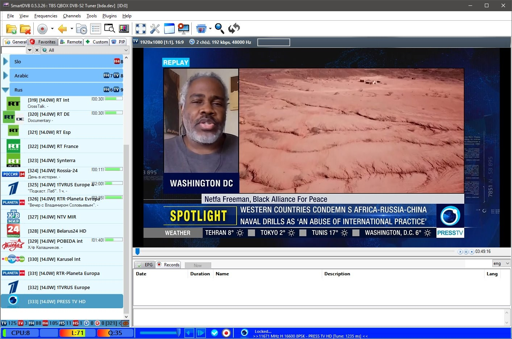
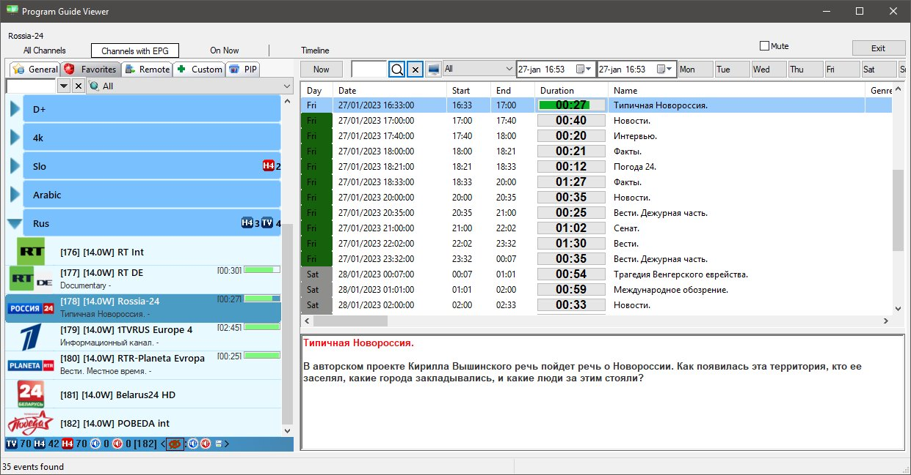
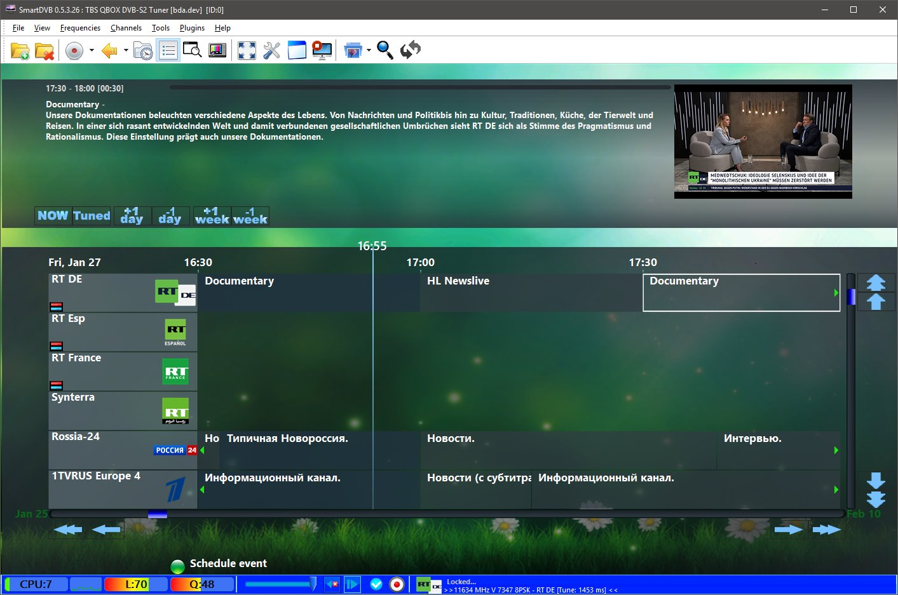

# Express AM8

Express AM8 ist ein russischer geostationärer Kommunikationssatellit.

Seine Sendeinhalte umfassen eine Reihe von umstrittenen <a href="https://rumble.com/v241fl2-play-with-sat-stuff.html">russischen</a>, syrischen und iranischen (Nachrichten-)Kanälen. 
die aufgrund von Sanktionen gegen Russland (alles) und Iran (Press TV) von den EU-Verteilern/Anbietern nicht ausgestrahlt werden dürfen. 

 ## Appendix

- [ 1.1 Satellitenbeschreibung ](https://github.com/happysat/Express-AM8/blob/main/README.md#satellite-description)
- [ 1.2 Dish und LNB ](https://github.com/happysat/Express-AM8/blob/main/README.md#dish-and-lnb)
- [ 1.3 Footprint ](https://github.com/happysat/Express-AM8/blob/main/README.md#footprint)
- [ 1.4 Dish Align to Express AM8 ](https://github.com/happysat/Express-AM8/blob/main/README.md#dish-align-to-express-am8)
- [ 1.5 Transponder und Frequenzen ](https://github.com/happysat/Express-AM8/blob/main/README.md#telemetry-transponders-and-beacon-frequencies)
- [ 1.6 T2-MI Technologie ](https://github.com/happysat/Express-AM8/blob/main/README.md#t2-mi-technology)
- [ 1.7 Satellitenempfänger ](https://github.com/happysat/Express-AM8/blob/main/README.md#satellite-receivers)
- [ 1.8 DVB-S Karten Software ](https://github.com/happysat/Express-AM8/blob/main/README.md#dvb-s-card-software)
- [ 1.9 Codecs, Player, Streaming Software ](https://github.com/happysat/Express-AM8/blob/main/README.md#codecs-players-streaming-software)
- [ 2.0 Elektronischer Programmführer XMLTV](https://github.com/happysat/Express-AM8/blob/main/README.md#electronic-program-guide-xmltv)
- [ 2.1 Nachrichten und Updates ](https://github.com/happysat/Express-AM8/blob/main/README.md#news-and-updates)
- [ 2.2 Haftungsausschluss ](https://github.com/happysat/Express-AM8/blob/main/README.md#disclaimer)

## Satellitenbeschreibung

Betrieben und im Besitz von RSCC (Russian Satellite Communications Company) von einer Orbitalposition auf 14° Grad West. 
<a href="https://www.n2yo.com/satellite/?s=40895#results">Express-AM8</a> wird hochwertige Festnetz- und Mobilkommunikationsdienste anbieten. 

sowie Rundfunkdienste für digitales Fernsehen und Radio, Datenübertragung,
Hochgeschwindigkeits-Internetzugang und sichere Regierungskommunikation. 

<a href="https://orbit.ing-now.com/satellite/40895/2015-048a/express-am8/">Express-AM8</a> (Norad:40895 2015-048A) wurde am 14. September 2015 von einer Proton M-Trägerrakete in die Umlaufbahn gebracht. 
Thales Alenia Space baute die Express-AM8-Nutzlast, und ISS Reshetnev konstruierte den Satellitenbus, der auf der Ekspress-1000NTB-Plattform basiert. 
Der Satellit hat eine Masse von 2.100 kg (4.600 lb), liefert 5.9 Kilowatt für seine Nutzlast und eine geplante Betriebsdauer von 15 Jahren. 

Es sollte berücksichtigt werden, dass Express AM8 kein gewöhnlicher DTH-Hochleistungssatellit wie Astra und Hotbird ist! 

Express AM8 unterliegt häufigen Frequenz- und Signalstärkeänderungen. 
Es werden Transponder mit niedrigen Symbolraten verwendet, und es werden viele Tests durchgeführt, die von DVB-S(2) bis T2-MI reichen. 

Die Details und Informationen zu den Transpondern/Kanälen können sich täglich ändern. 
Das macht diesen Satelliten zu einem interessanten exotischen "DX"-Satelliten mit transatlantischer Abdeckung und kundenspezifischen Konfigurationen für die Ausleuchtzone. 

Die Satellitentransponder werden auch regelmäßig gehackt oder durch Störsignale gestört. 
Dies ist kein Einzelfall und ist auch bei Eutelsat Hotbird Position (und einer Reihe anderer Satelliten) passiert. 

## Schüssel und LNB

Für den Empfang von Express-AM8 benötigt man eine Schüssel in der Größe >75 - 85 cm. 
Empfohlen wird eine Größe zwischen 80 - 1,20 cm. 

Die bei mir verwendeten Schüsseln sind: 
           
          
          &nbsp; &nbsp; &nbsp; &nbsp;&nbsp; &nbsp;  

89CM Triax und 90CM Noname Dish.

Jede Ku-Band Satelliten-TV (DRO/PLL-basierte) LNB kann für Express AM8 verwendet werden. 
Ich habe verschiedene Ergebnisse mit DRO und PLL-basierte, sondern zeigt deutlich eine enorme Zunahme der Frequenzstabilität YMMV. 

Regelmäßige Ku-Band Satelliten-TV LNB (DRO) leiden unter Drift in der Frequenz macht es schwieriger, einen stabilen Empfang für die niedrigen Symbolrate Signale zu halten. 
Wegen der äußeren Bedingungen (Temperaturschwankungen, Sonne, Wolken, Wind ect). 

In Gebrauch auf meinem Setup sind: 

 

Invertro Ultra Black LNB (DRO Altes Modell mit längerem Hals). 

 

Inverto Twin (PLL) LNB. 

## Footprint

Express AM8 trägt 12 Ku-Band Transponder mit drei Footprints:

Europa/Mittlerer Osten Fixed 1

Afrika/Mittlerer Osten Fixed 2. 
Und Lateinamerika/Ostküste Nordamerikas Fix 3. 

24 C-Band-Transponder mit Abdeckung von zwei Footprints:

Europa, Afrika und der Nahe Osten sowie Lateinamerika und die Ostküste Nordamerikas. 
Und die Nutzlast hat zwei L-Band-Transponder. 

## Dish align to Express-AM8

Es gibt mehrere Möglichkeiten, Express-AM8 am Himmel zu finden:

<a href="https://www.dishpointer.com" target="_blank">Dishpointer hat eine gute Website und eine Android-App.</a>

Geben Sie den Standort der Stadt ein und wählen Sie Express-AM8, um alle Details zu sehen.

Beachten Sie die Skew-Einstellungen des LNB! 
Auf der Website von Dish Pointer sind die Skew-Werte für Express AM8 unter dem Bild des gewählten Standorts aufgeführt. 

Oder das Programm <a href="http://www.al-soft.com/saa/satinfo.shtml" target="_blank">Satellite Antenna Alignment 4.0</a> 
für die Dish-Ausrichtung und viele weitere Optionen. 

Beispiele für den Express AM8-Empfang von Videos:

&nbsp; &nbsp; &nbsp; &nbsp; &nbsp; &nbsp;

## Telemetrie, Transponder und Bakenfrequenzen.

Telemetrie und Bakenfrequenzen: 
<a href="http://frequencyplansatellites.altervista.org/Beacon-Telemetry_Atlantic/Express_AM8.html" target="_blank">3405,10 R (Global oder Omni) / 3850,00 R
(Global) / 3850,50 L (Global) / 11199,50 R (Global).</a> 
 
 
[Up2date Express AM8 Transponder.ini file](https://github.com/happysat/Express-AM8/blob/main/3460.ini) 
 
 

 
Lyngsat Transponder Index 
 

 
KingOfSat Transponder Index 

## T2-MI Technologie

T2-MI (T2 Modulator Interface) ist eine Methode zur Verkapselung eines Satellitensignals in einen MPEG TS Transportstrom. 
Vereinfacht ausgedrückt, werden mit Hilfe der T2Mi-Schnittstelle Programmpakete im DVB-T2-Standard vom Satelliten zu Basisstationen
 zur Weiterverteilung an T2-Türmeübertragen,  
die dann terrestrisches Digitalfernsehen für Fernseher oder DVB-T2-Empfänger ausstrahlen. &nbsp; 
Das heißt, die Programmpakete in T2MI waren ursprünglich nicht für den Empfang durch heimische Satellitenempfänger gedacht. 
Aber mit der Entwicklung von Prozessoren für Satellitenreceiver, die sie verarbeiten können, wurde es möglich, diese TV-Kanäle zu Hause auf einem normalen Satellitenreceiver zu empfangen. 

 

Express AM8 verfügt über einige T2-MI-Transponder. 

 

Ausstrahlung von Kanälen auf DVB-T2-Multiplexen in der Ukraine.

## Satellitenempfänger

Nun, es gibt eine große Auswahl in diesem Bereich, es hängt ein wenig davon ab, was Sie sehen wollen. 

 

Vieles kann man schon mit einem normalen HD-Receiver sehen und es muss nicht der neueste Stand der Technik sein. 
Um die T2-MI-Multiplexe zu zeigen, braucht man natürlich einen Receiver der neuen Generation oder eine TBS-DVB-S-Karte ist empfehlenswert. 

Natürlich braucht man für die T2-MI Multiplexe einen Receiver der neuesten Generation oder eine <a href="https://www.tbsdtv.com/">TBS DVB-S Karte</a> wird empfohlen. 

Ci, Softcams oder Smartcards sind nicht notwendig, da alles Free To Air ausgestrahlt wird. 
Dies kann sich für die T2-MI Multiplexe in Zukunft ändern. 

Die in meinem Setup verwendeten Receiver sind: 

Dreambox 800se <a href="https://github.com/jack2015/openpli-dreambox-oe-core" target="_blank">OpenPLI 12.2</a> 
VuSolo2 <a href="http://images.mynonpublic.com/openatv/7.1/index.php?open=vusolo" target="_blank">Open-ATV</a> 
<a href="https://www.tbsdtv.com/" target="_blank">TBS Q-Box2</a>. 

## DVB-S-Kartensoftware

Es gibt eine große Auswahl an (kostenloser) Software für die DVB-S-Karten. 
Sie reicht von TV-Anwendungsbetrachtern bis hin zu Stream-Analysatoren. 

<a href="https://www.altx.ro/projects/altdvb/" target="_blank">AltDVB</a>
ist eine kostenlose Software, um digitales Fernsehen auf dem Windows-PC mit einem speziellen DVB-Hardware-Gerät zu sehen. 
Sie unterstützt die Standards DVB-S/S2 und T2-MI, 
Picture-in-Picture
(PIP), LAN-Streaming und viele andere Optionen und Funktionen. 

 

<a href="http://www.smartdvb.net/tempsite/index.html" target="_blank">SmartDVB</a>
ist eine kostenlose Digital-TV-Anwendung für Satelliten-TV-Karten.  
Sie unterstützt die Standards DVB-S/S2 und T2-MI. 
XMLTV-Importoption für EPG, Streaming, PIP und andere Optionen und Funktionen. 

 

<a href="https://sourceforge.net/projects/crazyscan/" target="_blank">Crazyscan</a>, <a href="http://ebspro.net/overview/" target="_blank">EBSPro</a> und <a
href="https://www.satellitescommunity.de/forum/index.php?thread/2005-iqmonitor-only-files/&amp;postID=45835#post45835" target="_blank">IQ Monitor</a> - Kostenlose Analysetools für Satelliten-DVB-Tuner zur Anzeige von Details und Infos zu Stream-Infos,  
Blind Scanning, SignalInfo, Konstellationen und vielen weiteren Optionen. 

 

## Codecs, Player, Streaming Software

 
<a href="https://github.com/DYefremov/DemonEditor" target="_blank">DemonEditor</a> 

Enigma2 Kanal- und Satellitenlisten-Editor für Windows und Linux. 

Hauptmerkmale des Programms: 
Bearbeiten von Bouquets, Kanälen, Satelliten, Import/Backup-Funktion, Unterstützung von Picons. 
Export von Bouquets mit IPTV-Diensten in m3u. 

Zuweisung von EPG aus DVB oder XML für IPTV-Dienste (nur Enigma2). 
Abspielen von IPTV oder anderen Streams direkt aus der Bouquetliste. 
Möglichkeit, EPG einzusehen und Timer zu verwalten (über HTTP API). 

 
<a href="https://mpv.io/">Mpv</a>
Freier, quelloffener und plattformübergreifender Media Player. 

<a href="https://github.com/Nevcairiel/LAVFilters/releases">LAV-Filter</a> sind eine Reihe von DirectShow-Filtern, die auf den Bibliotheken libavformat und libavcodec aus dem ffmpeg-Projekt basieren. 

 

Damit können Sie praktisch jedes Format in einem DirectShow-Player abspielen. 

<a href="http://madvr.com/">madVR</a> ist ein DirectShow-Video-Renderer, der von Hunderttausenden von Heimkino-Enthusiasten auf der ganzen Welt verwendet wird. 
Entwickelt als kompromissloser Ansatz, liefert madVR die ultimative Videowiedergabequalität, auf die kein Enthusiast verzichten sollte. 

 ## Electronic Program Guide XMLTV

TV-Kanäle auf Express AM8 senden keine Electronic Program Guide Daten. 
Es ist möglich, EPG Daten im XMLTV Format selbst zu importieren. 

Die enigma2 basierten Receiver haben das rytec Plugin in ihrem Image Feed zum Importieren von EPG Daten. 

 

DVB-S Kartensoftware einschließlich Smartdvb kann XMLTV importieren, so dass ein epg-Guide für die TV-Kanäle von Express AM8 zu sehen ist. 

 

Auch in den separaten Guides

 

 

Download 6 Tage XMLTV EPG für: 

[RT Deutschland](https://github.com/happysat/Express-AM8/blob/main/rt_de.xmltv) 

[RT Int, Rossia-24, NTV MIR, 1TVRUS Europe, POBEDA int, RTR-Planeta Evropa und Belarus24 HD.](https://github.com/happysat/Express-AM8/blob/main/rt.xmltv) 

## News und Updates

26/27 Januar 

 

Störsignal auf RT und fast allen anderen russischen Transpondern. 
Auf einigen Transpondern sind die Signalpegel höher als sonst.

25. Januar 

TV-Übertragungen im Südwesten Russlands wurden kurzzeitig durch eine Ansprache des ukrainischen Präsidenten gestört, die Störung betraf Satellitenübertragungen, so der Pressedienst der Regionalregierung.  
Die Betreiber mussten das Signal von einem Ersatzsatelliten umleiten. 

<a href="https://thepressunited.com/updates/zelensky-appears-on-russian-tv/" target="_blank">Zelensky erscheint im russischen Fernsehen</a>. 

24. Januar 

Pobeda wieder als "POBEDA int" auf 11653 V 4880 2/3. 

 

23. Januar 

IRIB - JAMEJAM1 HD, SAHAR BALKAN/AZARI, PRESS TV HD, HISPAN TV, iFILM ENGLISH, ALALAM HD - 11670 H 16596.

21. Januar 

PRESS TV HD - 11498 H Gone.

20. Januar 

Syria, Syria Sport 24, Syria CH1, Syria News, Drama 24, Sakaker - 11690 H 12110.

 

PRESS TV HD - 11498 H 6938. 

 

18. Januar 

1TVRUS sendet jetzt in 2/3.  
Pobeda wird abgeschaltet. 
Viele Unterbrechungen auf RT Transponder.  

 

 

17. Januar 

Syrische Transponder löschen 11600 V. 

5. Januar 2023 

Express AM8 Transponder 11647V wurde heute um 18:30 Uhr vom ukrainischen Ministerium für strategische Kommunikation gehackt. 
Eine Neujahrsansprache des ukrainischen Präsidenten V. Selensky wurde kurzzeitig in ukrainischer Sprache auf allen Programmplätzen des T2-MI-Transponders ausgestrahlt. 

 

## Disclaimer

Diese Website ist nur für Bildungszwecke gedacht. 
Die Europäische Union bezeichnet alternative Nachrichtenquellen auf diesem Satelliten als Propaganda. 

Einwohner der Europäischen Union dürfen diese Inhalte ansehen, aber nicht live verbreiten. 
Dieser Satellit und die Kanäle, die seine Inhalte übertragen, werden von RSCC (Russian Satellite Communications Company) kontrolliert.

## Autoren

- [Express AM8 von Happysat](https://github.com/happysat/Express-AM8
