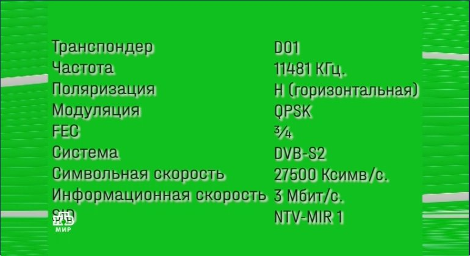

# Express AM8

Express AM8 ist ein russischer geostationärer Kommunikationssatellit.

Zu seinen Sendeinhalten gehören eine Reihe umstrittener <a href="https://rumble.com/v241fl2-play-with-sat-stuff.html">russischer</a>, syrischer und iranischer (Nachrichten-)Kanäle. 
Die aufgrund von Sanktionen gegen Russland (alle sender) und den Iran (Press TV) von der Ausstrahlung durch EU-Distributoren/Anbieter ausgeschlossen sind. 
          
## Anhang

- [1.0 TV- und Radiokanäle](https://github.com/happysat/Express-AM8/blob/main/README_DE.md#tv--und-radiokan%C3%A4le)
- [1.1 Satellitenbeschreibung ](https://github.com/happysat/Express-AM8/blob/main/README_DE.md#satellitenbeschreibung)
- [1.2 Schüssel und LNB](https://github.com/happysat/Express-AM8/blob/main/README_DE.md#sch%C3%BCssel-und-lnb)
- [1.3 Footprint](https://github.com/happysat/Express-AM8/blob/main/README_DE.md#footprint)
- [1.4 Schüssel an Express AM8 ausrichten ](https://github.com/happysat/Express-AM8/blob/main/README_DE.md#sch%C3%BCssel-auf-express-am8-ausrichten)
- [1.5 Transponder und Frequenzen ](https://github.com/happysat/Express-AM8/blob/main/README_DE.md#telemetrie-transponder-und-beacon-frequenzen)
- [1.6 T2-MI-Technologie](https://github.com/happysat/Express-AM8/blob/main/README_DE.md#t2-mi-technologie)
- [1.7 Satellitenempfänger](https://github.com/happysat/Express-AM8/blob/main/README_DE.md#satellitenempf%C3%A4nger)
- [1.8 DVB-S-Kartensoftware](https://github.com/happysat/Express-AM8/blob/main/README_DE.md#dvb-s-kartensoftware)
- [1.9 Codecs, Player, Streaming-Software](https://github.com/happysat/Express-AM8/blob/main/README_DE.md#codecs-player-streaming-software)
- [2.0 Neuigkeiten und Updates ](https://github.com/happysat/Express-AM8/blob/main/README_DE.md#neuigkeiten-und-aktualisierungen)
- [2.1 Haftungsausschluss ](https://github.com/happysat/Express-AM8/blob/main/README_DE.md#haftungsausschluss)

## TV- und Radiokanäle
Die folgenden Fernseh- und Radiosender werden in DVB-S(2) HD über Express-AM8 ausgestrahlt:

RT Int., RT Deutsch, RT France, RT Espanol, RT Arabic. 

Russisch: Rossiya 24, RTR Planeta, NTV Mir, Perivy Kanal, Dom Kino, Karusel, Radio Sputnik. 

Weißrussland: Weißrussland 24 HD, Radio Weißrussland Int. 

Iran: Irib TV 1, Sahar TV Bosnisch/Azari, Press TV HD, Hispan TV, iFilm, Al Alam TV. 

Syrien: Syria Sat Ch., Syria Sport 24, Syria 1, Syria News, Syria Drama, Sakaker Kids. 

Libanon: Etihad TV, Al Manar TV, Al Nour Radio. 

## Satellitenbeschreibung

Betrieben und im Besitz von RSCC (Russian Satellite Communications Company) von einem orbitalen Stellplatz bei 14° West. 
<a href="https://www.n2yo.com/satellite/?s=40895#results">Express-AM8</a> wird hochwertige Festnetz- und Mobilkommunikationsdienste bereitstellen. 

Neben Rundfunkdiensten für digitales Fernsehen und Hörfunk, Datenübertragung,
Highspeed-Internetzugang und sichere Behördenkommunikation. 

<a href="https://orbit.ing-now.com/satellite/40895/2015-048a/express-am8/">Express-AM8</a> (Norad:40895 2015-048A) wurde von einem gestartet Proton-M-Trägerrakete am 14. September 2015 in den Orbit. 
Thales Alenia Space baute die Express-AM8-Nutzlast und ISS Reshetnev konstruierte den Satellitenbus, der auf der Ekspress-1000NTB-Plattform basierte. 
Der Satellit hat eine Masse von 2.100 kg (4.600 lb), liefert 5,9 Kilowatt Nutzlast und eine geplante Betriebslebensdauer von 15 Jahren. 

Es sollte berücksichtigt werden, dass Express AM8 kein gewöhnlicher DTH-Hochleistungssatellit wie Astra und Hotbird ist! 

Express AM8 unterliegt häufigen Frequenz- und Signalstärkeänderungen. 
Es werden Transponder mit niedrigen Symbolraten verwendet und viele Tests durchgeführt, die von DVB-S(2) bis T2-MI variieren. 

Details und Informationen zu Transpondern/Kanälen können sich täglich ändern. 
Das macht ihn zu einem interessanten exotischen "DX"-Satelliten mit transatlantischer Abdeckung und kundenspezifischen Cross-Strap-Footprint-Konfigurationen. 

Auch die Satellitentransponder werden regelmäßig gehackt oder durch Störsignale gestört. 
Dies ist kein Einzelfall, und es ist auch bei Eutelsat Hotbird Position (und einer Reihe anderer Satelliten) passiert. 

## Schüssel und LNB

Für den Empfang von Express-AM8 benötigen Sie eine Schüssel in der Größe >75 - 85 cm. 
Empfohlen wird eine Größe zwischen 80 - 1,20 cm. 

In meinem Setup verwendete Gerichte sind: 
            
           
           &nbsp; &nbsp; &nbsp; &nbsp;&nbsp; &nbsp;  

89CM Triax und 90CM Noname Dish.
          
Jeder Ku-Band-Satelliten-TV-LNB (DRO/PLL-basiert) kann für Express AM8 verwendet werden. 

Herkömmliche Ku-Band-Satelliten-TV-LNB (DRO) leiden unter Frequenzdrift, was es schwieriger macht, einen stabilen Empfang für die Signale mit niedriger Symbolrate aufrechtzuerhalten. 
Aufgrund äußerer Bedingungen (Temperaturänderungen, Sonne, Wolken, Wind usw.). 

Auf meinem Setup werden verwendet: 

 

Invertro Ultra Black LNB (DRO Altes Modell mit längerem Hals). 

 

Inverto Twin (PLL) LNB. 

## Footprint

Express AM8 trägt 12 Ku-Band Transponder Linear 12x36 MHz; 4x54 MHz (150W) mit drei Footprints:

Europa/Naher Osten Fixed 1

Afrika/Naher Osten Fixed 2. 
Und Lateinamerika/Ostküste Nordamerikas Fixed 3. 

24 C-Band Transponder Circular 24x40 MHz (100W) mit Abdeckung von zwei Footprints:

Europa, Afrika und der Nahe Osten sowie Lateinamerika und die Ostküste Nordamerikas. 
Und die Nutzlast hat zwei L-Band-Transponder. 

## Schüssel auf Express-AM8 ausrichten

Es gibt mehrere Möglichkeiten, Express-AM8 am Himmel zu finden:

<a href="https://www.dishpointer.com" target="_blank">Dishpointer hat eine gute Website und Android-App.</a>

Geben Sie den Standort der Stadt ein und wählen Sie Express AM8, um alle Details anzuzeigen.

Beachten Sie die Skew-Einstellungen des LNB! 
Die Dish Pointer-Website listet die Skew-Werte für Express AM8 unter dem Bild Ihres ausgewählten Standorts auf. 

Und versuchen Sie, den stärksten Transponder einzustellen <a href="https://en.kingofsat.net/tp.php?tp=12861" target="_blank">11623 V DVB-S2 8PSK 7347 3/4.</ a> 

Wenn es nicht funktioniert, versuchen Sie es mit Telstar auf 15 West, einem starken Transponder mit 1 FTA-Kanal auf <a href="https://en.kingofsat.net/tp.php?tp=1086" target="_blank">11377 V DVB-S2 QPSK 8750 3/5.</a> 

 

Wenn es funktioniert und für genügend Signal fein abgestimmt ist, bewegen Sie die Schüssel auf 14 West, es sollte nur eine kleine Anpassung sein. 

Oder das Programm <a href="http://www.al-soft.com/saa/satinfo.shtml" target="_blank">Satellite Antenna Alignment 4.0</a> 
Für Schüssel ausrichtung und viele weitere Optionen. 

Beispiele für den Express AM8-Empfang von Video:

&nbsp; &nbsp; &nbsp; &nbsp;&nbsp; &nbsp;

## Telemetrie, Transponder und Beacon-Frequenzen.

Telemetrie- und Bakenfrequenzen: 

 

11199,50 GHz R (global). 
 
 
[Up2date Express AM8 Transponder.ini-Datei](https://github.com/happysat/Express-AM8/blob/main/3460.ini) 
 
 

 
Lyngsat-Transponderindex 
 

 
KingOfSat-Transponderindex 

## T2-MI-Technologie

T2-MI (T2 Modulator Interface) ist ein Verfahren zum Einkapseln eines Satellitensignals in einen MPEG TS-Transportstrom. 
Vereinfacht ausgedrückt werden über die T2Mi-Schnittstelle Programmpakete im DVB-T2-Standard vom Satelliten zur Basis übertragen
Erdfunkstellen zur Weiterverteilung an T2-Türme,  
die dann terrestrisches Digitalfernsehen für Fernseher oder DVB-T2-Receiver übertragen. &nbsp; 
Das heißt, die Kanalpakete in T2MI waren ursprünglich nicht dafür gedacht, von inländischen Satellitenempfängern empfangen zu werden.  
Aber mit der Entwicklung von Prozessoren für Satellitenempfänger, die diese verarbeiten können, wurde es möglich, diese Fernsehsender zu Hause auf einem normalen Heimsatellitenempfänger zu empfangen. 

Express AM8 hatte einige T2-MI-Transponder. 

 

Sendekanäle zu DVB-T2-Multiplexen in der Ukraine.

Update T2-MI Multistreams mit dem russischen Paket scheinen leider vollständig auf Express AM6 53° Ost migriert zu sein! 

## Satellitenempfänger

Nun, in diesem Bereich gibt es eine große Auswahl, es hängt ein bisschen davon ab, was Sie sehen möchten. 

 

Mit einem normalen HD-Receiver ist schon vieles zu sehen und muss es auch nicht
Stand der Technik sein. 
Ci, Softcams oder Smartcards sind nicht erforderlich, da alles Free To Air ausgestrahlt wird. 

Damit die T2-MI Multiplexe oder noch mehr gezeigt werden können, benötigt man natürlich einen Receiver der neuen Generation oder noch besser eine <a href="https://www.tbsdtv.com/">TBS DVB-S Karte</a> wird empfohlen. 

Kann digitale TV-Kanäle mehrerer Standards empfangen: DVB-S2X/S2/S/DVB-T2/C2/T/C(J.83 A/B/C)/ISDB-T/C/ATSC1.0 
Unterstützt auch CCM, VCM und Multi Input Streams. 

Vorteile sind die Analyse von Streams, schnelleres Blindscanning, große Softwareauswahl (Viewer/Headends), Unterstützung mehrerer Plattformen für Linux/Windwows/ARM, Medienfunktionen Kodi, Hinzufügen von zweiten Tunern in engima2-basierten Receivern. 

In meinem Setup verwendete Empfänger sind: 

<a href="https://www.tbsiptv.com/tbs5530-multi-standard-universal-tv-tuner-usb-card" target="_blank">TBS5530</a>. 

## DVB-S-Kartensoftware

Es gibt eine große Auswahl an (kostenloser) Software für die DVB-S-Karten. 
Von Zuschauern für TV-Anwendungen bis hin zu Stream-Analyzern. 

<a href="https://www.altx.ro/projects/altdvb/" target="_blank">AltDVB</a>
ist eine kostenlose Software zum Ansehen von digitalem Fernsehen auf Ihrem Windows-PC mit einem dedizierten DVB-Hardwaregerät. 
Es unterstützt die Standards DVB-S/S2 und T2-MI, 
Picture-in-Picture (PIP), LAN-Streaming und viele weitere Optionen und Funktionen. 

 

<a href="http://www.smartdvb.net/tempsite/index.html" target="_blank">SmartDVB</a>
ist eine kostenlose Digital-TV-Anwendung für Satelliten-TV-Karten.  
Es unterstützt die Standards DVB-S/S2 und T2-MI. 
XMLTV-Importoption für EPG, Streaming, PIP und andere Optionen und Funktionen. 

 

<a href="https://sourceforge.net/projects/crazyscan/" target="_blank">Crazyscan</a>, <a href="http://ebspro.net/overview/" target="_blank ">EBSPro</a> und <a
href="https://www.satellitescommunity.de/forum/index.php?thread/2005-iqmonitor-only-files/&amp;postID=45835#post45835" target="_blank">IQ Monitor</a> - Kostenlose Analyse-Tools für Satelliten-DVB-Tuner, um Details und Informationen zu Stream-Informationen anzuzeigen,  
Blind Scanning, SignalInfo, Konstellationen und viele weitere Optionen. 

 

## Codecs, Player, Streaming-Software

Software DVB-S-Demodulator

 

Der Demodulator funktioniert mit RTL-SDR, Airspy, HackRF, SDRplay und PlutoSDR. 
Es kann DVB-S- und S2-Signale mit sehr niedriger Symbolrate demodulieren, jedoch nicht über 2000 ks. 

[Mehr über Software DVB-S Demodulator hier.](https://github.com/happysat/Es-Hail-2-Oscar-100#software-dvb-s-demodulator) 

[Und SDR auf LNB-Ausgang einrichten.](https://github.com/happysat/Es-Hail-2-Oscar-100#bias-tee) 

 
<a href="https://github.com/DYefremov/DemonEditor" target="_blank">DemonEditor</a> 

Enigma2 Kanal- und Satelliten listen-editor für Windows und Linux. 

Hauptmerkmale des Programms: 

Bearbeiten von Bouquets, Kanälen, Satelliten, Import-/Backup-Funktion, Unterstützung von Picons. 
Export von Blumensträußen mit IPTV-Diensten in m3u. 
Zuweisung von EPG von DVB oder XML für IPTV-Dienste, Wiedergabe von IPTV oder anderen Streams. 

 
<a href="https://mpv.io/">MPV</a>
Kostenloser, quelloffener und plattformübergreifender Mediaplayer. 

<a href="https://github.com/Nevcairiel/LAVFilters/releases">LAV-Filter</a> sind eine Reihe von DirectShow-Filtern, die auf den libavformat- und libavcodec-Bibliotheken des ffmpeg-Projekts basieren. 

 

Dadurch können Sie praktisch jedes Format in einem DirectShow-Player abspielen. 

<a href="http://madvr.com/">madVR</a> ist ein DirectShow-Video-Renderer, der von Hunderttausenden von Heimkino-Enthusiasten auf der ganzen Welt verwendet wird. 
madVR wurde als kompromissloser Ansatz entwickelt und bietet die ultimative Videowiedergabequalität, auf die kein Enthusiast verzichten sollte. 

## Neuigkeiten und Aktualisierungen

13 Mai 

RT und Synterra haben Transponder 11638 V / 11121 H hinterlassen (immer noch erhältlich auf 53 East). 

29 April 

1TVRus-Testkarte weg, sendet wieder. 

IRIB weg 11544 V DVB-S2/8PSK 13300 3/5. 

IRIB 11671 H 16600 3/5 neue Kanäle: ALALAM SYRIA, IFILM ARABIC und SAHAR KURDISH 

9 April 

NTV zeigt den Umzug nach 53 East Banner: 

 

7 April 

IRIB Änderungen: 

 

28 März 

IRIB zurruck auf 11544 V DVB-S2/8PSK 13300 3/5. 

27 März 

IRIB auf 11555V wieder weg. 

17 März 

Die neue und experimentelle Frequenz für die ausländischen Fernsehsender des IRIB-Pakets der Iranian Broadcasting Corporation wurde aktiviert und mehrere Fernseh- und Radiosender begannen mit der Ausstrahlung auf 11555V 30000 3/5. 

 

15 März 

Dom Kino, Karusel Int und 1TVRus (mit sender umstellung hinweise) zurruck auf alte TP. 

 

14 März 

RT Transponder zurruck auf 11638 V 1/2 16574 RT Esp, RT Int, RT De und RT France. 

 

13 März 

RT, 1TVRus, Dom Kino, Karusel Transponder kein Signal. 

NTV Mir, RT Eng, RT Fr, RT Esp, RT Arab, RT De, 1TVRUS Europe, RTR-Planeta Europe, Rossia 24, Belarus-24 HD und Radio Belarus,
erschienen auf Express AM 6 53 Ost TP: 11481 H 27500 1/2 DVB-S2. 

Dom Kino, Karusel Int erschienen auf Express AM 6 12532 H 27500 1/2 DVB-S2. 

12 März 

RT-Transponder ausgeschaltet, Jamming auf anderen Kanälen fortgesetzt. 

11 März 

So ziemlich alle Transponder sind von Störungen betroffen, außer dem syrischen Mux und Al Manar. 

 

1TVRus leidet unter Unterbrechungs-Hacks 

9 März 

Signal Jamming alle 30 Sekunden begann erneut, folgende TPs sind betroffen: 11.653V (1TVRUS), 11.110H (NTVmir) und 11.025H (Rossiya24, RTR Planeta), 11638H (Belarus24). 

 

1TVRus wurde am frühen Morgen gehackt, als 2 x 5 Minuten lang die „tatsächliche Zahl“ der Opfer seit Kriegsbeginn berichtete. 

6 März 

Transponder: 11671 H 16600 DVB-S2/8PSK 3/5 IRIB Geänderte SID. 

15 Februar 

Die Europäische Union kann RT Arabic im Rahmen neuer antirussischer Sanktionen auf ihrem Territorium verbieten. 

Auf Hotbird zeigt der Kanal bereits einen schwarzen Bildschirm, die Übertragungen werden natürlich auf Express AM8 fortgesetzt. 
RT Arabic wird auf dem eu-Beam (fixed 1) als Synterra bezeichnet und ist auch auf dem Fixed 2-Beam im Nahen Osten verfügbar. 

9 Februar 

11671 H Radio 01 / 07 Weltdienst hinzugefügt.

3 Februar 

Der Nachrichtensender Russia Today Deutschland (RT-DE), der bereits seit letztem Jahr Sanktionen innerhalb der Europäischen Union unterliegt, hat alle journalistischen Aktivitäten von RT Germany im Land eingestellt. 

Letzten Monat tat RT dasselbe in Frankreich. 

Das bedeutet nicht, dass es keine RT-Programme mehr gibt, die auf Frankreich oder Deutschland ausgerichtet sind. 
RT sendet jetzt außerhalb der EU und sendet weiterhin auf 14 Grad West. 

1 Februar 

 

11623 1TVRus ersetzt durch Dom Kino. 

 

11653 Pobeda ersetzt durch 1TVRus. 

30 Januar 

T2-MI Multistreams mit dem russischen Paket scheinen vollständig auf Express AM6 53° Ost migriert zu sein. 
Die Kanäle in T2-MI waren ursprünglich für den terrestrischen DVB-T2-Rundfunk in Novorossia bestimmt. 

27 Januar 

Einige Transponder haben tatsächlich mehr Sendeleistung. 

 

11541 H RT Arabisch, Fix Ku2, 21 % / 3,40 dB. 

 

Die Störung geht weiter, gut sichtbar auf Transponder B3 11025 H Rossiya 24 und RTR Planeta. 

26 Januar 

 

Störsignal auf RT und fast allen anderen russischen Transpondern. 
Einige Transponder zeigen erhöhte Signalpegel als üblich. 

T2-MI Transponder an 11647 Aus.

25 Januar 

Fernsehübertragungen im Südwesten Russlands wurden durch eine Ansprache des ukrainischen Präsidenten kurzzeitig unterbrochen, die Störung betraf Satellitenübertragungen, wie der Pressedienst der Regionalregierung mitteilte.  
Die Betreiber mussten das Signal von einem Backup-Satelliten umleiten. 

<a href="https://thepressunited.com/updates/zelensky-appears-on-russian-tv/" target="_blank">Zelensky tritt im russischen Fernsehen auf</a>. 

24 Januar 

Pobeda zurück als "POBEDA int" auf 11653 V 4880 2/3. 

 

23 Januar 

IRIB - JAMEJAM1 HD, SAHAR BALKAN/AZARI, PRESS TV HD, HISPAN TV, iFILM ENGLISCH, ALALAM HD - 11670 H 16596.

21 Januar 

PRESSE TV HD - 11498 H Weg.

20 Januar 

Syrien, Syria Sport 24, Syria CH1, Syria News, Drama 24, Sakaker - 11690 H 12110.

 

PRESSE TV HD - 11498 H 6938. 

 

18 Januar 

1TVRUS sendet jetzt in 2/3.  
Pobeda ist ausgeschaltet. 
Viele Unterbrechungen auf RT Transponder. 

 

 

17 Januar 

Syrischer Transponder klar 11600 V. 

5 Januar 2023 

Express AM8-Transponder 11647V wurde heute um 18:30 Uhr vom ukrainischen Ministerium für strategische Kommunikation gehackt. 
Eine Neujahrsansprache des ukrainischen Präsidenten V. Selensky wurde in Kürze auf allen Programmplätzen des T2-MI-Transponders auf Ukrainisch ausgestrahlt. 

 

21. Juli 2022 
<a href="https://eng.rscc.ru/press/satellite-being-born-siberia-rscc-signs-contract-r/">Der Start von Express AM4 ist für 2026 geplant.</a> 

Es wird den Slot bei 11°W auf der geostationären Umlaufbahn einnehmen und auch 14°W reservieren. 
Der Satellit wird vom Khrunichev Space Center mit der Proton-Trägerrakete in die Umlaufbahn gebracht. 

Ausgestattet mit 63 aktiven Transpondern bei einer Nutzlastleistung von 14 kW für die geplante 15-jährige Lebensdauer im Orbit. 
Seine zehn Antennen werden eine leistungsstarke Abdeckung über der Russischen Föderation und den GUS-Staaten und seinen steuerbaren Antennen bieten
kann verwendet werden, um die Kommunikation zu jedem Punkt innerhalb der Sichtweite des Satelliten bereitzustellen. 

## Haftungsausschluss

Diese Website dient nur zu Bildungszwecken. 
Die Europäische Union bezeichnet alternative Nachrichtenquellen auf diesem Satelliten als Propaganda. 

Einwohner der Europäischen Union dürfen diese Inhalte sehen, aber nicht live verteilen. 
Dieser Satellit und seine Inhaltsübertragungskanäle werden von RSCC (Russian Satellite Communications Company) kontrolliert.

## Autor

- [Express AM8 by Happysat](https://github.com/happysat/Express-AM8/blob/main/README_DE.md)
